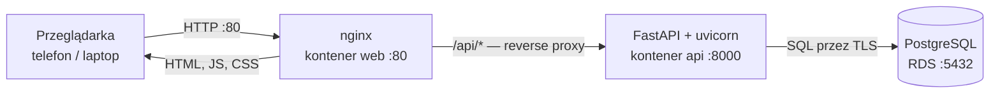
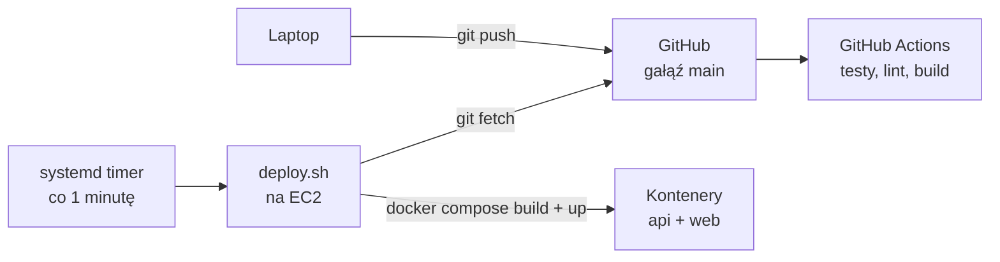

# Gorilla — przegląd technologii

Aplikacja do zapisywania treningów: logujesz serie, powtórzenia i ciężary,
budujesz własną bibliotekę ćwiczeń i plany treningowe. Ten dokument opisuje,
z czego jest zbudowana i jak te elementy się ze sobą łączą.

---

## Frontend

Aplikacja jednostronicowa (SPA) w przeglądarce.

| Technologia | Rola |
|---|---|
| **React 19** | warstwa widoku |
| **Vite 8** | serwer deweloperski i bundler produkcyjny |
| **React Router 7** | routing po stronie klienta (`/workouts`, `/plans`, `/exercises`) |
| **TanStack Query 5** | pobieranie danych, cache, unieważnianie po mutacjach |
| **Tailwind CSS 4** | style; cała paleta jako tokeny w `@theme` |
| **vite-plugin-pwa** | manifest i service worker (instalacja „jak apka" na telefonie) |
| **oxlint** | linter |

Stan serwera trzyma wyłącznie TanStack Query — nie ma Reduxa ani Contextu na
dane. Klucze zapytań (`['workouts']`, `['plans', id]`, `['auth','me']`) są
umową między komponentami: mutacja unieważnia klucz, a lista sama się odświeża.

---

## Backend

REST API.

| Technologia | Rola |
|---|---|
| **FastAPI** | framework HTTP, walidacja, automatyczna dokumentacja `/docs` |
| **uvicorn** | serwer ASGI, który uruchamia aplikację |
| **SQLAlchemy 2** | ORM — modele `User`, `Exercise`, `Workout`, `SetEntry`, `WorkoutPlan`, `PlanExercise` |
| **Alembic** | migracje schematu bazy |
| **Pydantic 2** + **pydantic-settings** | schematy żądań/odpowiedzi oraz konfiguracja ze zmiennych środowiskowych |
| **psycopg2** | sterownik PostgreSQL |
| **python-jose** | podpisywanie i weryfikacja tokenów JWT |
| **passlib + bcrypt** | hashowanie haseł |

**Uwierzytelnianie**: logowanie zwraca token JWT, przeglądarka trzyma go
w `localStorage` pod kluczem `gorilla_token`, a każde kolejne żądanie wysyła go
w nagłówku `Authorization: Bearer …`. Nie ma ciasteczek ani sesji po stronie
serwera — API jest bezstanowe.

---

## Baza danych

**PostgreSQL**. Lokalnie instalacja przez Homebrew, na produkcji **Amazon RDS**
(baza `gym_tracker`, połączenie wymuszone przez TLS — `sslmode=require`).

Schematem zarządza wyłącznie Alembic. Jedna zależność jest celowa i warto
o niej wiedzieć: usunięcie planu treningowego **nie kasuje** treningów z niego
utworzonych — ustawia im `plan_id` na `NULL` (`ondelete="SET NULL"`).

---

## Konteneryzacja

| Technologia | Rola |
|---|---|
| **Docker** | obrazy aplikacji |
| **Docker Compose** | uruchamia oba kontenery razem jako jeden układ |
| **nginx** | serwuje zbudowany frontend i przekazuje `/api/` do backendu |

Dwa obrazy, oba wieloetapowe lub oparte na chudych bazach:

- **api** — `python:3.12-slim`, działa jako użytkownik bez uprawnień roota,
  port 8000. Nie jest publikowany na hosta.
- **web** — `node:22-alpine` buduje frontend, wynik trafia do
  `nginx:1.27-alpine`. Port 80 to jedyne wyjście na świat.

---

## Infrastruktura (AWS)

| Element | Rola |
|---|---|
| **EC2** (Ubuntu) | maszyna, na której chodzą kontenery |
| **RDS PostgreSQL** | baza danych, w tym samym VPC co EC2 |
| **Security groups** | zapora: port 80 ze świata, 22 z Twojego IP, 5432 tylko z security group instancji EC2 |
| **VPC** | wspólna sieć prywatna dla EC2 i RDS — RDS nie ma adresu publicznego |

---

## CI/CD

| Element | Rola |
|---|---|
| **GitHub Actions** (`.github/workflows/CI.yaml`) | po każdym pushu: `pytest` dla backendu, lint i build dla frontendu — **na serwerach GitHuba** |
| **systemd timer + `deploy.sh`** | co minutę sprawdza `origin/main` i wdraża zmiany — **na EC2** |

CI i CD są tu rozdzielone i nic o sobie nie wiedzą. GitHub Actions **nie ma
dostępu** do maszyny: to serwer sam odpytuje GitHuba. Dlatego nigdzie nie ma
kluczy SSH ani otwartych portów przychodzących dla wdrożeń.

---

## Kubernetes (ścieżka alternatywna)

**k3s** — lekka dystrybucja Kubernetesa, z wbudowanym **Traefikiem** jako
Ingress. Manifesty w `k8s/` odtwarzają ten sam układ co Compose: Deployment
i Service dla `api` i `web`, Ingress na porcie 80, konfiguracja w Secretcie.

To wariant do nauki, nie ulepszenie — przy dwóch kontenerach na jednej maszynie
nie daje przewagi nad Compose. Szczegóły w [k8s/README.md](k8s/README.md).

---

## Narzędzia deweloperskie

- **`dev.py`** — uruchamia backend i frontend jednocześnie: dwa okna terminala
  na macOS i Linuksie z pulpitem, sesja **tmux** na serwerze bez pulpitu.
- **`venv`** — izolowane środowisko Pythona do pracy lokalnej (w kontenerach
  niepotrzebne, bo obraz sam w sobie jest izolacją).

---

## Jak to się łączy — ruch użytkownika

Kluczowa decyzja: **frontend i API są pod tym samym adresem**. Przeglądarka
odpytuje `/api/...`, a nie osobny host — nginx wewnątrz kontenera `web`
przekazuje te żądania do kontenera `api`. Konsekwencje:

- otwarty musi być **tylko port 80**, backend nie jest wystawiony na świat,
- **nie ma CORS-a**, bo żądania nie przekraczają granicy origina,
- obraz frontendu nie zawiera żadnego adresu ani IP, więc działa niezmieniony
  na dowolnej maszynie i domenie.

---

## Jak to się łączy — droga kodu na serwer

`deploy.sh` porównuje lokalny commit z `origin/main` i gdy są równe, kończy się
natychmiast — dzięki temu może chodzić co minutę bez obciążania maszyny.
Gdy wykryje zmianę: `git reset --hard`, przebudowanie obrazów, migracje
**nowym** obrazem, restart kontenerów i sprzątanie starych warstw.

---

## Rzeczy nieoczywiste, warte zapamiętania

**`VITE_API_BASE_URL` jest wklejany w kod przy budowaniu, nie przy starcie.**
Vite podmienia `import.meta.env` w trakcie kompilacji, więc adres API jest
zamrożony w bundlu. Dlatego produkcyjny obraz budujemy z wartością `/api`
(ścieżka względna) zamiast konkretnego adresu — inaczej obraz byłby przypięty
do jednego IP i po każdym restarcie instancji trzeba by go przebudowywać.

**Architektura procesora musi się zgadzać, reszta nie.** Obraz nosi w sobie
cały userspace, ale jądro pożycza od hosta. Obraz zbudowany na Debianie
działa na Amazon Linuksie, ale obraz `arm64` nie ruszy na `x86_64`.

**Resolver nginxa nie stosuje listy `search` z `/etc/resolv.conf`.** Pod Docker
Compose nazwa `api` rozwiązuje się sama, w Kubernetesie potrzebna jest pełna
nazwa `api.<namespace>.svc.cluster.local`. Dlatego adres backendu jest zmienną
`API_UPSTREAM`, wypełnianą przy starcie kontenera.

**Sekrety nigdy nie trafiają do obrazu ani do repozytorium.** `backend/app/.env`
jest w `.gitignore` i w `.dockerignore`; wartości wstrzykuje się przy
uruchomieniu — przez `env_file` w Compose albo Secret w Kubernetesie.

**Brak HTTPS.** Ruch idzie po zwykłym HTTP, więc hasła logowania lecą otwartym
tekstem. Do testów wystarcza, ale przed udostępnieniem aplikacji komukolwiek
trzeba to domknąć — najprościej podmieniając nginx na Caddy z automatycznym
certyfikatem Let's Encrypt.
